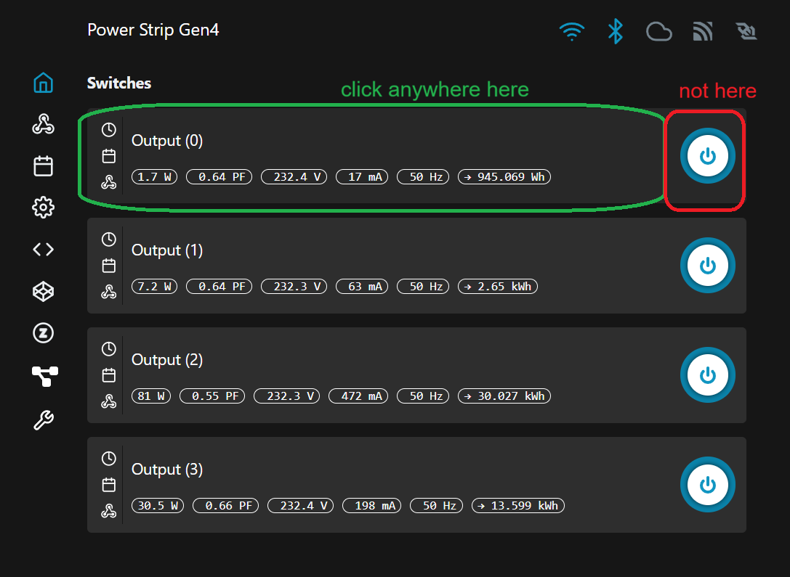
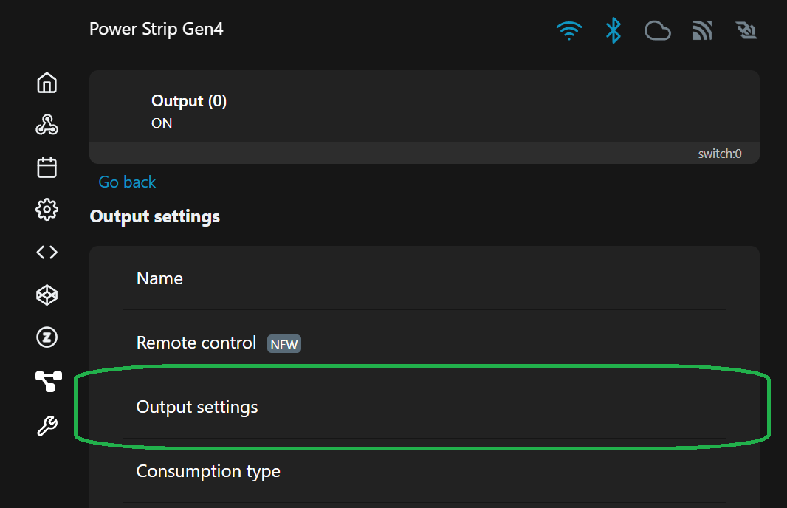
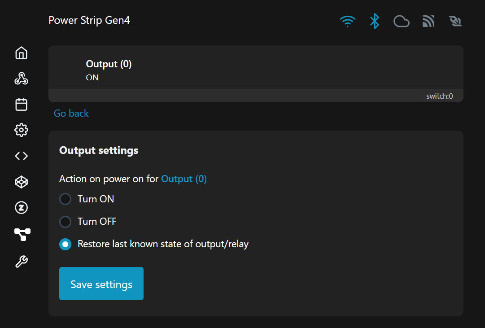

Is your Shelly Power Strip (in my case Gen4) randomly turning off all sockets every few days?

This is probably because of updates or some other internal mechanism.\
Here's how to fix it:

1. Open the web interface of the Shelly device
2. On the "Home" tab click the switch's entry (not the on/off button, just anywhere else on the entry):
   
3. Next, click "Output settings":
   
4. Select "Turn On" or "Restore last known state of output/relay" depending on your preference.
   
5. Click "save settings".
6. Repeat for all 4 switches.
