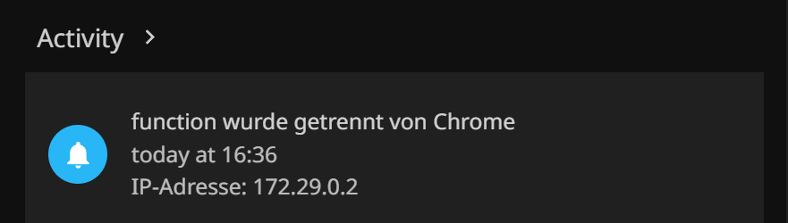
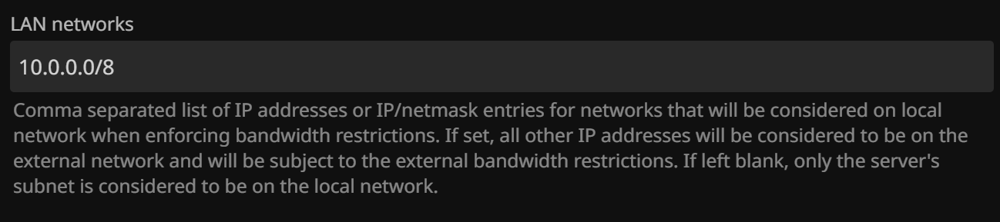
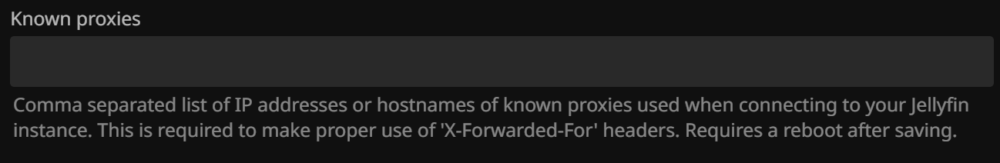
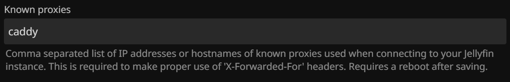
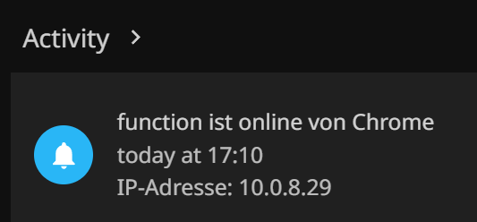

Maybe your Jellyfin dashboard looks like this right now:

This is not only annoying for troubleshooting, but also makes the "LAN networks" setting (found in Advanced -> Networking, shown below) useless because all IPs that Jellyfin sees will just be the IP of your reverse proxy.

This is where the "Known proxies" setting comes in (also found in Advanced -> Networking).

But what do you put there? It says it right on there: the IP or hostname of your reverse proxy. But not just any IP or hostname! Jellyfin needs the IP or hostname of your reverse proxy _as seen by Jellyfin_.

How we figure this out? Let's first think about the IP and tackle the hostname later.

If you run the reverse proxy "bare metal" (not Docker), the IP is the IP of the machine it runs on. If it's a Docker container (my case), it depends on the exact setup. In my case, Caddy and Jellyfin share a Docker network, so the IP is the _internal_ Docker IP of the Caddy container, which is something like 172.29.0.2 in my case, as seen in the first screenshot.

We could just put this IP into the "Known proxies" setting, but what if the IP changes at some point? Then we would have to update the setting again. So let's try to use a hostname instead.

For a reverse proxy on "bare metal", the hostname can be anything that resolves to the IP we just determined. This heavily depends on your local DNS setup. Maybe you run Pi-hole or AdGuard Home. But in my It's-All-Docker setup, we can use Docker's built in "embedded DNS server" which registers container and service names as hostnames. This is the same feature we can use to configure something like `reverse_proxy jellyfin:8096` in Caddy - `jellyfin` resolves to the internal Docker IP of the Jellyfin container if Jellyfin and Caddy share a Docker network. So we can use the hostname `caddy` in the "Known proxies" setting, which resolves to the internal Docker IP of the Caddy container.

And that's it! Now you can see the real IPs of your clients in Jellyfin's dashboard, and the "LAN networks" setting will work as expected. About the `X-Forwarded-For` header: Caddy automatically adds it to requests, so you don't have to do anything special for that. If you use a different reverse proxy, make sure it adds the `X-Forwarded-For` header.

Further reading and documentation:

- https://docs.docker.com/engine/network/#user-defined-networks
- https://jellyfin.org/docs/general/post-install/networking/reverse-proxy/#forwarded-for-headers
